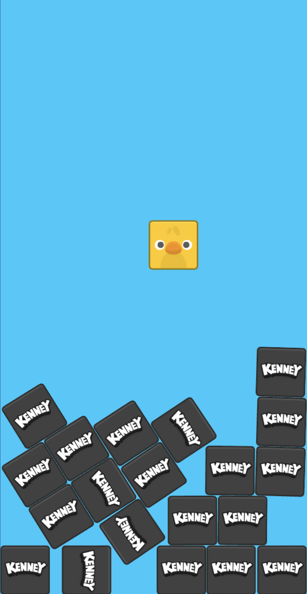
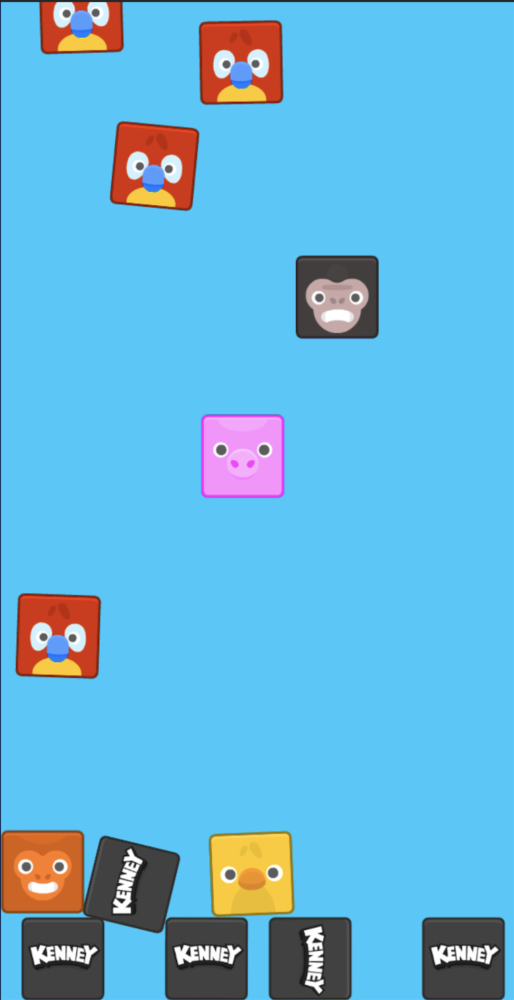

<h1 align="center">
  Memory Game with 2D physics
</h1>

This is a memory game which is using 2D physics as well. 
Technologies currently used in this game are as follows:
<ol>
<li>Phaser 3</li>
<li>TypeScript</li>
<li>WebPack</li>
<li>Planck JS</li>
</ol>

---

Screenshots of the game in action:

